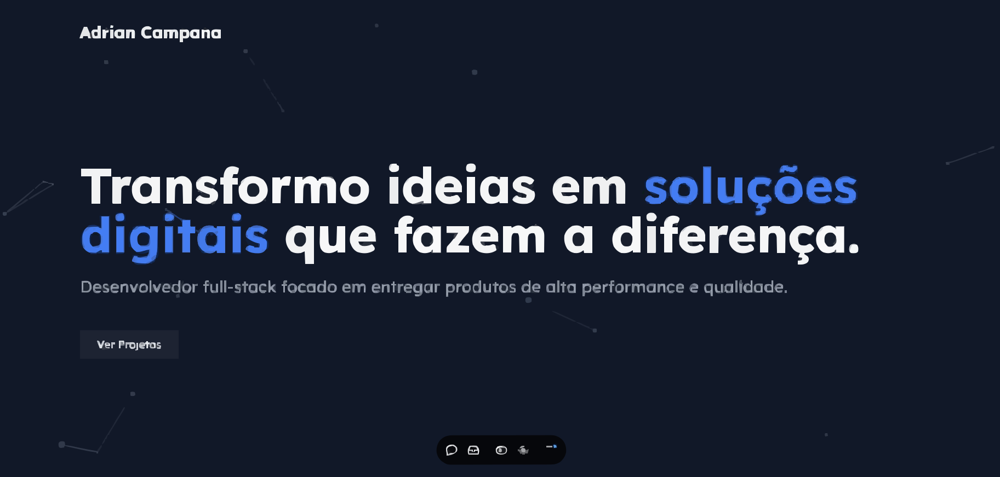

# 🚀 Meu Portfólio de Desenvolvedor

     

## ✨ Sobre o Projeto

Este é o meu portfólio pessoal, desenvolvido para apresentar meus projetos, habilidades e experiência como desenvolvedor full-stack. Com um design moderno e funcionalidades interativas, este portfólio foi criado para proporcionar uma navegação intuitiva e destacar cada projeto de maneira única.

## 🔍 Demonstração

Explore a versão completa [aqui]([https://seulink.com](https://portfolio-adriancampana-scz4.vercel.app)).

## 🔧 Funcionalidades

- **Apresentação dos Projetos**: Seção dedicada para destacar cada um dos meus projetos com detalhes, imagens e links para repositórios.
- **Navegação Interativa**: Animações suaves para navegação entre seções e abertura de modais com `Framer Motion`.
- **Responsividade Total**: Design responsivo para uma ótima experiência em dispositivos móveis e desktops.
- **Animações com `Framer Motion`**: Transições dinâmicas para melhorar a experiência visual e a usabilidade.
- **Temas Personalizados**: Ajuste de cores e temas de acordo com as preferências de design.

## 📚 Tecnologias Utilizadas

- **[React](https://reactjs.org/)** - Biblioteca JavaScript para construção de interfaces de usuário.
- **[TypeScript](https://www.typescriptlang.org/)** - Superset do JavaScript que adiciona tipagem estática ao código.
- **[Tailwind CSS](https://tailwindcss.com/)** - Framework CSS utilitário para estilização rápida e responsiva.
- **[Framer Motion](https://www.framer.com/motion/)** - Biblioteca para animações e transições no React.
